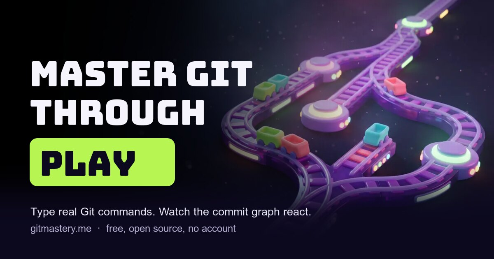

<div align="center">
  <a href="https://gitmastery.me">
    
  </a>

  <h1>GitMastery</h1>

  <p><b>Master Git through play.</b><br/>
  A browser game where you type real Git commands and watch the commit graph react.</p>

  <p>
    <a href="https://gitmastery.me"><b>Play now</b></a> ·
    <a href="#features">Features</a> ·
    <a href="#getting-started">Getting started</a> ·
    <a href="#contributing">Contributing</a> ·
    <a href="#support-this-project">Sponsor</a>
  </p>

  <p>
    
    
    
  </p>

  <p>
    
    
    
    
  </p>
</div>

---

## 🎮 What it is

Most Git tutorials are something you read. GitMastery is something you **play**.

```console
$ git switch -c feature
Switched to a new branch 'feature'
$ git commit -am "add cat gifs"
[feature 7b2d410] add cat gifs        ★ +50 XP
```

Every level runs a full Git simulation in your browser: you type real commands into a real
terminal, the commit graph grows as you go, and nothing you break is ever real. No install, no
account, no ads — just `git init` and go.

**[→ Start at gitmastery.me](https://gitmastery.me)**

## 📣 Creators found it on their own

Nobody was paid for these. They just liked the game.

| Creator                                                                  | Reel                                                                                                                |
| ------------------------------------------------------------------------ | ------------------------------------------------------------------------------------------------------------------- |
| [@softwarewithnick](https://www.instagram.com/softwarewithnick/)         | ["Master git easily 😎"](https://www.instagram.com/reel/DWoi-4RDliT/)                                               |
| [@softwarewithnick](https://www.instagram.com/softwarewithnick/)         | ["Master git easily 😎" — second reel](https://www.instagram.com/reel/DWojk9kgqUC/)                                 |
| [@staxx_ai](https://www.instagram.com/staxx_ai/)                         | ["Website no one really talks about… but should 👀"](https://www.instagram.com/reel/DXMVbNOEmWh/)                   |
| [@shivaconceptsolution](https://www.instagram.com/shivaconceptsolution/) | ["Want to master Git without crying over lost commits ever again? 😭"](https://www.instagram.com/reel/DRcloKUDRAd/) |

Posted about it somewhere? [Open an issue](https://github.com/MikaStiebitz/Git-Mastery/issues/new)
and it goes on the list.

<a id="features"></a>

## ✨ Features

### Learn by doing

|                          |                                                                           |
| ------------------------ | ------------------------------------------------------------------------- |
| 🖥️ **Real terminal**     | A simulated Git environment that answers like the real thing              |
| 🌳 **Live commit graph** | Every level draws your repository as you type — tap a node for details    |
| 🎯 **Structured path**   | Stages that build on each other, from `git init` to `rebase` and `bisect` |
| 🎮 **Playground**        | A free sandbox with no level goals, plus a printable cheat sheet          |
| 📈 **Progress tracking** | Points, completed levels and your current stage, saved locally            |
| 🌍 **Six languages**     | English, German, Spanish, Persian, Hindi and Turkish                      |

### Play for it

|                        |                                                                             |
| ---------------------- | --------------------------------------------------------------------------- |
| 🏪 **Shop**            | Spend earned coins on terminal themes, a mascot and power-ups               |
| 🎨 **Terminal themes** | Matrix green, Golden luxury and Dark blue — they repaint the whole terminal |
| 🎲 **Mini games**      | Branch Master, Graph Puzzle, Commit Champion and Merge Master               |
| 🏆 **Badges**          | Achievement tokens that show up in the navbar                               |
| ⚡ **Double XP**       | A weekend multiplier, if you buy it                                         |

## 🛠️ Tech stack

**Next.js 16** (App Router, static export) · **TypeScript** · **Tailwind CSS 4** · **GSAP** ·
**Radix UI** · **Lucide** — with a full Git simulation, level engine and progress system written
from scratch, and React Context plus `localStorage` holding the state. No backend, no database,
no tracking beyond privacy-friendly analytics.

The visual system is documented in [DESIGN.md](./DESIGN.md); the product decisions behind it
live in [PRODUCT.md](./PRODUCT.md).

<a id="getting-started"></a>

## 🚦 Getting started

```bash
git clone https://github.com/MikaStiebitz/Git-Mastery
cd Git-Mastery
npm install
npm run dev
```

Then open <http://localhost:3000>. Node 20 or newer.

| Command            | What it does                       |
| ------------------ | ---------------------------------- |
| `npm run dev`      | Dev server with hot reload         |
| `npm run build`    | Static export to `out/`            |
| `npm run test`     | Vitest in watch mode               |
| `npm run test:run` | The suite once, the way CI runs it |
| `npm run format`   | Prettier over the repo             |

## 📚 Documentation

- [Commands](./src/commands/COMMANDS.md) — how Git commands are implemented and how to add one
- [Levels](./src/levels/LEVELS.md) — how stages and levels work, and how to write a new one
- [Translations](./src/translations/TRANSLATIONS.md) — how to add or fix a language
- [Design system](./DESIGN.md) — tokens, components and the rules they follow

<a id="contributing"></a>

## 🤝 Contributing

Pull requests are welcome — new levels and translations especially.

1. Fork the repository
2. Branch off: `git checkout -b feature/amazing-feature`
3. Make your changes, then `npm run test:run` and `npm run build`
4. Commit and push, then open a pull request

CI has to stay green: build, typecheck and the full test suite run on every pull request. The
translation parity test will fail if a language is missing a key, so add new strings to all six.

<a id="support-this-project"></a>

## ⭐ Support this project

GitMastery is free, has no ads and needs no account. Sponsors pay for the domain, the hosting
and the time that goes into new levels — and keep the whole thing open source.

<p align="center">
  <a href="https://github.com/sponsors/MikaStiebitz">
    
  </a>
  <a href="https://buymeacoffee.com/mika.stiebitz">
    
  </a>
</p>

Not in a position to sponsor? A star helps just as much, and sharing it with someone who is
fighting their first merge conflict helps even more.

## 📈 Star history

<div align="center">
  <a href="https://star-history.dera.page/#MikaStiebitz/Git-Mastery&Date">
    <picture>
      <source media="(prefers-color-scheme: dark)" srcset="https://star-history.dera.page/svg?repos=MikaStiebitz/Git-Mastery&type=Date&theme=dark" />
      <source media="(prefers-color-scheme: light)" srcset="https://star-history.dera.page/svg?repos=MikaStiebitz/Git-Mastery&type=Date" />
      
    </picture>
  </a>
</div>

## 📜 License

Restricted Use License — see [LICENSE](./LICENSE).

---

<p align="center">
  Made with ❤️ by <a href="https://github.com/MikaStiebitz">Mika Stiebitz</a>
</p>
